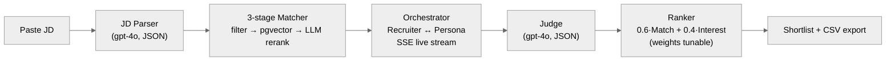

# Recruiter Agent — AI-Powered Talent Scouting & Engagement

> Paste a Job Description → get a ranked shortlist of candidates with **Match Score** (skill / experience / domain / location, with per-dimension justifications) and **Interest Score** (assessed from a *simulated* conversational outreach).

Built on **Azure OpenAI** + **Azure Container Apps** + **Postgres Flexible (pgvector)** + **Next.js on Static Web Apps**. Demo-grade — autoscale-to-0, ~$25-30/mo idle, ~$1 per JD run.

- **🚀 Live demo:** https://mango-flower-0619c860f.7.azurestaticapps.net/
- **🛠 API:** https://recruit-recruiter-demo-api.yellowpond-0170cfea.japaneast.azurecontainerapps.io/
- **Repo:** https://github.com/DandaAkhilReddy/recruiter_agent
- **Architecture:** [docs/architecture.md](docs/architecture.md)
- **Sample JD + sample shortlist:** [samples/](samples/)

## What it does



**Pipeline (≈90s end-to-end for top-20 outreach):**

1. **JD Parser** — extracts `title`, `seniority`, `min_yoe`, `must_have_skills`, `nice_to_have`, `domain`, `location_pref`, `remote_ok`.
2. **3-stage Matcher** — hard filter SQL → pgvector cosine top-50 → LLM rerank (gpt-4o, batched 10) emits **per-dimension scores 0-100 + one-line justifications** keyed by skill/experience/domain/location.
3. **Conversation Orchestrator** — Recruiter Agent ↔ Candidate Persona Agent run 3-5 turns each in parallel under `Semaphore(5)`. Streamed live to the UI via SSE.
4. **Judge** — reads each transcript, emits Interest Score with `signals[]`, `concerns[]`, and a one-paragraph reasoning.
5. **Ranker** — `final = 0.6·match + 0.4·interest`. Sliders in the UI re-weight from stored raw scores — no LLM re-call.

## Why explainability is the differentiator

Recruiters trust scores they can interrogate. Returning `match_score: 78` is a number; returning `{skill: 85, experience: 70, domain: 60, location: 90}` plus *"Has python+postgres+aws but missing kafka"* is an argument. Every score in this app is a sum of dimensions, every dimension comes with a one-line justification, every interest score comes with signals + concerns + reasoning.

## Why the demo doesn't look scripted

Variance is forced into the candidate pool at *seed* time — every candidate is sampled into one of four interest archetypes (`strong 40% / medium 30% / weak 20% / wildcard 10%`) and their `motivations` text is mutated to match. The Persona Agent reads the archetype as part of its system prompt, so strong candidates ask follow-ups and signal availability, weak candidates politely decline, and wildcards are unpredictable — all without relying on LLM whim at conversation time.

## Quickstart (local)

```bash
# 1. Postgres + pgvector
docker compose up -d

# 2. Backend
cd backend
python -m venv .venv && source .venv/bin/activate     # Windows: .venv\Scripts\activate
pip install -r requirements.txt
cp ../.env.example ../.env                            # fill AOAI_* values
alembic upgrade head
python scripts/seed_candidates.py --count 500
uvicorn app.main:app --reload --port 8000

# 3. Frontend (new terminal)
cd frontend
npm install
npm run dev   # http://localhost:3000
```

You'll need an Azure OpenAI deployment with three models: `gpt-4o`, `gpt-4o-mini`, and `text-embedding-3-large` (call them whatever, just match the env var names).

## Deploy to Azure

```bash
# one-time
azd auth login
azd init                                              # if you cloned without azd context
azd env new recruiter-demo
azd env set AOAI_ENDPOINT "https://your-aoai.openai.azure.com/"
azd env set AOAI_API_KEY  "..."
azd env set POSTGRES_ADMIN_PASSWORD "$(openssl rand -base64 24)"
# then
azd up
```

Provisions: Resource Group + Log Analytics + App Insights + ACR + Key Vault + Postgres Flex (B1ms, vector + pgcrypto extensions) + Container Apps Environment + Container App + Static Web App.

After provisioning, run `alembic upgrade head` and `python scripts/seed_candidates.py --count 500` against the new Postgres URL (set `DATABASE_URL` accordingly).

## Project layout

```
backend/    FastAPI + SQLAlchemy 2.0 (async) + Alembic + Azure OpenAI
frontend/   Next.js 14 App Router + Tailwind, SSE for live stream
infra/      Bicep modules, azd-compatible
samples/    Sample JDs + sample candidate snippet + sample shortlist JSON
docs/       Architecture diagrams (Mermaid)
.planning/  Spec docs (REQUIREMENTS / DESIGN / TASKS)
```

## API surface

| Method | Path | Purpose |
|---|---|---|
| `GET`  | `/health` | liveness |
| `POST` | `/jobs` | parse JD → returns `JobOut` |
| `GET`  | `/jobs/{id}` | retrieve parsed job |
| `POST` | `/jobs/{id}/match` | run 3-stage matcher → top-K with breakdowns |
| `POST` | `/jobs/{id}/outreach` | 202; kicks background outreach + judge loop |
| `GET`  | `/jobs/{id}/stream` | SSE: `outreach_started`, `turn`, `conversation_done`, `judge`, `done` |
| `GET`  | `/jobs/{id}/shortlist?limit=&match_w=&interest_w=` | ranked items |
| `GET`  | `/jobs/{id}/shortlist.csv` | streaming CSV |
| `GET`  | `/jobs/{id}/conversations/{candidate_id}` | full transcript + judge result |

## Cost (demo profile, autoscale-to-0)

- Container Apps (idle): $0
- Postgres Flex Burstable B1ms (1 vCPU / 2 GiB): ~$15-20/mo
- Static Web App Free, Key Vault, Log Analytics, ACR: <$10/mo combined
- Azure OpenAI: pay-per-token, ~$1 per full JD run

**Idle: ~$25-30/mo · per demo run: ~$1**

## Limitations & future work

- Single replica — the SSE event bus is in-process. For multi-replica we'd swap for Redis Streams or similar.
- Synthetic candidate pool only. Adding a real ATS adapter (Greenhouse / Lever) would slot into the same `Candidate` model.
- No auth — public endpoint, rate-limited via slowapi (10/min/IP on `POST /jobs`).
- No real outbound email/SMS — outreach is simulated. Wiring SendGrid would be a few hours.
- An MCP server wrapping the API (so a recruiter can drive the whole pipeline from Claude Desktop) would be the natural next move.

## License

MIT
