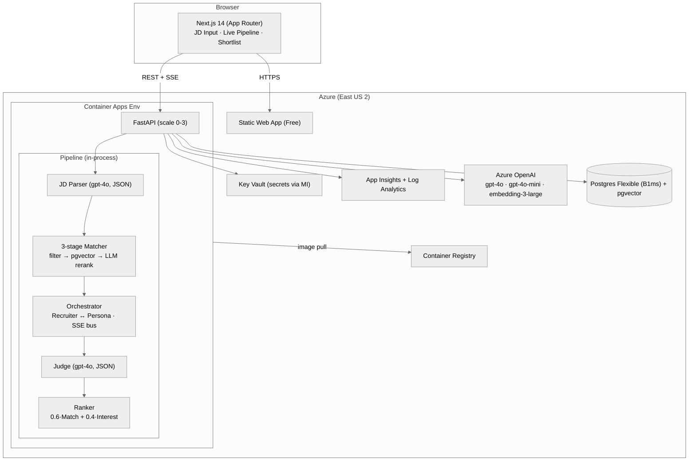

# Architecture

## System diagram

## Pipeline detail

1. **JD Parser** (`gpt-4o`, temp 0, seed 42, JSON mode) — extracts `title`, `seniority`, `min_yoe`, `must_have_skills`, `nice_to_have`, `domain`, `location_pref`, `remote_ok` from raw JD text. Embedding of the parsed fields is stored alongside the row so the matcher doesn't re-embed.

2. **3-stage Matcher** — `POST /jobs/{id}/match`:
   - **Hard filter** (SQL): `candidates.yoe >= job.min_yoe AND candidates.skills && job.must_have_skills`.
   - **Embedding rerank** (`pgvector`): cosine `<=>` against the JD embedding, top-K (default 50).
   - **LLM rerank** (`gpt-4o`, temp 0, seed 42, JSON mode, batched 10 with `Semaphore(5)`): emits per-candidate `{skill, experience, domain, location}` 0-100 + one-line justifications.
   - Composite `match = 0.40·skill + 0.25·experience + 0.20·domain + 0.15·location`.

3. **Conversation Orchestrator** — `POST /jobs/{id}/outreach` (202):
   - Selects top-N from `scores` joined with candidates.
   - For each (with `Semaphore(5)`): Recruiter (`gpt-4o-mini`, temp 0.4, seed 42) ↔ Persona (`gpt-4o-mini`, **temp 0.7** — variance is the goal) for up to `max_turns` rounds.
   - Persists each `Message` and emits an SSE `turn` event so the UI renders in real time.

4. **Judge** (`gpt-4o`, temp 0, seed 42, JSON mode):
   - Reads the full transcript, returns `{interest_score (0-100), signals[], concerns[], reasoning}` keyed by an anchored rubric (0=hard no … 100=explicit commitment).
   - Failure on one candidate doesn't crash the batch — surfaces as `judge_failed` SSE.

5. **Ranker** — `GET /jobs/{id}/shortlist?match_w=&interest_w=`:
   - `final = match_w · match + interest_w · interest` with paired sliders client-side.
   - Re-weighting reads from stored raw scores — no LLM re-call. Slider drag feels instant and is free.
   - CSV export via `GET /jobs/{id}/shortlist.csv` (StreamingResponse).

## Why this shape

**Explainability.** Every score is a sum of dimensions, every dimension comes with a one-line justification, every interest score comes with signals + concerns + reasoning. The recruiter can interrogate the answer.

**Realistic demo.** Variance is forced into the candidate pool at *seed* time (40% strong / 30% medium / 20% weak / 10% wildcard archetypes), with archetype-specific motivations baked into each profile and surfaced to the Persona Agent at conversation time. So the demo conversations show a mix of "yes I'm in" and "happy where I am" responses *without* relying on LLM whim.

**Live SSE.** The 4-stage timeline + chat-bubble feed makes the demo video visceral. The event bus replays buffered events on connect, so we don't lose the early `outreach_started` event when the page navigates a few hundred ms after `POST /jobs`.

**Cost discipline.** Container Apps autoscale to 0; idle infra ≈ $25-30/mo. Per JD run ≈ $1 in AOAI tokens (gpt-4o + gpt-4o-mini). Caps in `app/config.py`: pool 500, rerank top-K 50, batch 10, outreach top-K 20, max turns 4.

## API surface

| Method | Path | Purpose |
|---|---|---|
| GET | `/health` | liveness |
| POST | `/jobs` | parse JD → returns `JobOut` |
| GET | `/jobs/{id}` | retrieve parsed job |
| POST | `/jobs/{id}/match` | run 3-stage matcher → top-K with breakdowns |
| POST | `/jobs/{id}/outreach` | 202; kicks background outreach + judge loop |
| GET | `/jobs/{id}/stream` | SSE: `outreach_started`, `turn`, `conversation_done`, `judge`, `done` |
| GET | `/jobs/{id}/shortlist?limit=&match_w=&interest_w=` | ranked items |
| GET | `/jobs/{id}/shortlist.csv` | streaming CSV |
| GET | `/jobs/{id}/conversations/{candidate_id}` | full transcript + judge result |
