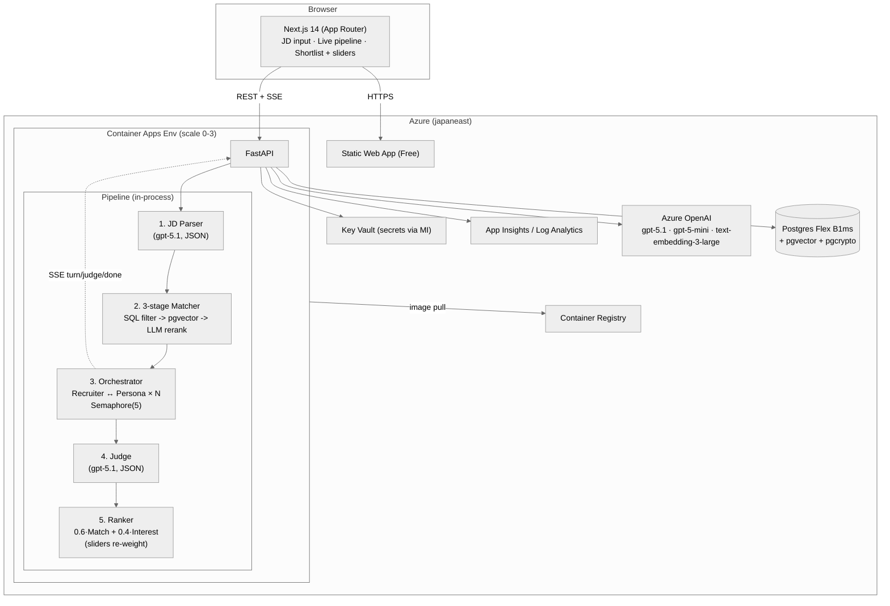

# Architecture

Paste a Job Description → get a ranked shortlist of candidates with **Match Score** (skill / experience / domain / location, with per-dimension justifications) and **Interest Score** (assessed from a *simulated* conversational outreach). Both scores fuse into one user-tunable **Final Score** the recruiter can interrogate.

- **Live demo:** [mango-flower-0619c860f.7.azurestaticapps.net](https://mango-flower-0619c860f.7.azurestaticapps.net/)
- **API:** [recruit-recruiter-demo-api.yellowpond-0170cfea.japaneast.azurecontainerapps.io](https://recruit-recruiter-demo-api.yellowpond-0170cfea.japaneast.azurecontainerapps.io/)

## System diagram



## Pipeline detail

1. **JD Parser** (`gpt-5.1`, JSON mode) — extracts `title`, `seniority`, `min_yoe`, `must_have_skills`, `nice_to_have`, `domain`, `location_pref`, `remote_ok` from raw JD text. Embedding of the parsed fields is stored alongside the job row so the matcher doesn't re-embed.

2. **3-stage Matcher** — `POST /jobs/{id}/match`:
   - **Hard filter** (SQL): `candidates.yoe >= job.min_yoe AND candidates.skills && job.must_have_skills` (Postgres array overlap).
   - **Embedding rerank** (`pgvector`): cosine `<=>` against the JD embedding, top-K (default 50).
   - **LLM rerank** (`gpt-5.1`, JSON mode, batched 10 with `Semaphore(5)`): emits per-candidate `{skill, experience, domain, location}` 0-100 + one-line justifications keyed by dimension.
   - Composite formula below.

3. **Conversation Orchestrator** — `POST /jobs/{id}/outreach` (202):
   - Selects top-N from `scores` joined with candidates.
   - For each (with `Semaphore(5)`): Recruiter (`gpt-5-mini`, low variance) ↔ Persona (`gpt-5-mini`, **higher variance** — variance is the goal) for up to `max_turns` rounds.
   - Persists each `Message` and emits an SSE `turn` event so the UI renders in real time.

4. **Judge** (`gpt-5.1`, JSON mode):
   - Reads the full transcript, returns `{interest_score (0-100), signals[], concerns[], reasoning}` keyed by an anchored rubric (`0` = hard no … `100` = explicit commitment).
   - Failure on one candidate doesn't crash the batch — surfaces as `judge_failed` SSE.

5. **Ranker** — `GET /jobs/{id}/shortlist?match_w=&interest_w=`:
   - Final formula below; weights must sum to 1.0 (server validates `422` otherwise).
   - Re-weighting reads from stored raw scores — **no LLM re-call**. Slider drag feels instant and is free.
   - CSV export via `GET /jobs/{id}/shortlist.csv` (StreamingResponse).

## Scoring logic — two scores fuse into one

### Match Score (0–100) — *does the candidate fit the role?*

Computed by [matcher.py](../backend/app/services/matcher.py) from the LLM rerank's per-dimension scores:

```text
match = 0.40·skill + 0.25·experience + 0.20·domain + 0.15·location
```

| Dim | Weight | What it measures |
| --- | --- | --- |
| **skill** | 0.40 | Overlap of must-have / nice-to-have with candidate skill list |
| **experience** | 0.25 | YOE / seniority alignment with `min_yoe` and seniority band |
| **domain** | 0.20 | Industry/domain proximity (e.g. "payments backend" vs "ad-tech backend") |
| **location** | 0.15 | Location pref + remote-OK match |

**Why these weights.** Skill heavily dominates because it's the strongest single signal a recruiter can interrogate. Location is lowest because remote-OK absorbs most variance. They're constants — the user-facing sliders only re-weight at the *next* stage. Each dimension also carries a one-line LLM-written justification, persisted in `scores.match_justifications` and surfaced verbatim in the shortlist UI + CSV.

### Interest Score (0–100) — *will they actually engage?*

Computed by [judge.py](../backend/app/services/judge.py) after the Recruiter ↔ Persona conversation. The Judge LLM reads the full transcript and emits one anchored rubric value plus structured signals:

```json
{
  "interest_score": 0,
  "signals":   ["asked about comp", "named availability"],
  "concerns":  ["worried about RTO", "happy at current role"],
  "reasoning": "one paragraph"
}
```

Anchored rubric:

| Score | Anchor |
| --- | --- |
| `0` | Hard no |
| `25` | Polite decline |
| `50` | Curious / non-committal |
| `75` | Engaged with follow-ups |
| `100` | Explicit commitment / availability named |

**Why a separate score.** A great match who says *"I'm happy where I am"* should rank below a slightly weaker match who says *"Monday at 3pm works."* Match alone misses this; Interest alone ignores fit. Combining them is the whole differentiator.

### Final Score — fuse with user-tunable weights

Computed by [ranker.py](../backend/app/services/ranker.py) at request time:

```text
final = match_w · match + interest_w · interest    (default 0.6 / 0.4)
```

- `match_w + interest_w == 1.0` (server returns `422` otherwise).
- Sliders in the UI re-weight from **stored raw scores** — no LLM re-call, instant + free.
- **Partial data** (covered by [test_ranker.py](../backend/tests/test_ranker.py)):
  - If interest is missing (outreach not yet run), `final = match`.
  - If match is missing, `final = interest`.
  - If both missing, `final = null` and the row sinks to the bottom of the list.

### Realism note — variance lives at seed time, not runtime

Variance is forced into the candidate pool at **seed time**, not conversation time: every candidate is sampled into one of four interest archetypes (`strong 40% / medium 30% / weak 20% / wildcard 10%`) and their `motivations` text is mutated to match. The Persona Agent reads the archetype as part of its system prompt, so demo runs deterministically show the full distribution of "yes" / "maybe" / "no" — not LLM whim.

See [seed_candidates.py](../backend/scripts/seed_candidates.py) for the archetype assignment + motivation-mutation logic.

## Why this shape

**Explainability.** Every score is a sum of dimensions, every dimension comes with a one-line justification, every interest score comes with signals + concerns + reasoning. The recruiter can interrogate the answer.

**Realistic demo without scripting.** Forced archetype distribution at seed time means the demo shows a mix of "yes I'm in" and "happy where I am" responses without relying on LLM whim at conversation time.

**Live SSE.** The 4-stage timeline + chat-bubble feed makes the demo video visceral. The event bus replays buffered events on connect so we don't lose the early `outreach_started` event when the page navigates a few hundred ms after `POST /jobs`.

**Cost discipline.** Container Apps autoscale to 0; idle infra ≈ $25-30/mo. Per JD run ≈ $1 in AOAI tokens. Caps in `app/config.py`: pool 500, rerank top-K 50, batch 10, outreach top-K 20, max turns 4.

**gpt-5.x compat layer.** [services/aoai.py](../backend/app/services/aoai.py) wraps `AsyncAzureOpenAI` and transparently strips/renames params the new reasoning models reject (`temperature`, `seed`, `top_p` → stripped on `Unsupported value` 400; `max_tokens` → renamed to `max_completion_tokens` with 10× multiplier + `reasoning_effort=minimal` so visible tokens aren't burned on hidden reasoning). Lets the rest of the codebase remain model-agnostic. Covered by 12 unit tests in [test_aoai_proxy.py](../backend/tests/test_aoai_proxy.py).

## API surface

| Method | Path | Purpose |
| --- | --- | --- |
| `GET` | `/health` | liveness |
| `POST` | `/jobs` | parse JD → returns `JobOut` (rate-limited 10/min/IP) |
| `GET` | `/jobs/{id}` | retrieve parsed job |
| `POST` | `/jobs/{id}/match` | run 3-stage matcher → top-K with breakdowns |
| `POST` | `/jobs/{id}/outreach` | 202; kicks background outreach + judge loop |
| `GET` | `/jobs/{id}/stream` | SSE: `outreach_started`, `turn`, `conversation_done`, `judge`, `done` |
| `GET` | `/jobs/{id}/shortlist?limit=&match_w=&interest_w=` | ranked items |
| `GET` | `/jobs/{id}/shortlist.csv` | streaming CSV |
| `GET` | `/jobs/{id}/conversations/{candidate_id}` | full transcript + judge result |

## Test coverage on the scoring path

- [test_matcher.py](../backend/tests/test_matcher.py) — `composite_match_score` formula (e.g. `80·0.40 + 70·0.25 + 60·0.20 + 90·0.15 = 75.5`)
- [test_ranker.py](../backend/tests/test_ranker.py) — `composite_final_score` formula + null-input edge cases
- [test_judge_offline.py](../backend/tests/test_judge_offline.py) — Judge service with mocked AOAI; rubric parsing
- [test_e2e_pipeline.py](../backend/tests/integration/test_e2e_pipeline.py) — full pipeline against real Postgres + pgvector with mocked AOAI
- [test_aoai_proxy.py](../backend/tests/test_aoai_proxy.py), [test_rate_limit.py](../backend/tests/test_rate_limit.py), [test_stream_sse.py](../backend/tests/integration/test_stream_sse.py) — load-bearing infra

89 tests total, gated in CI on every PR.
